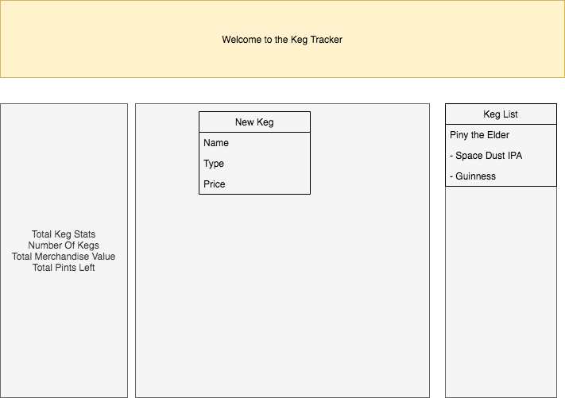
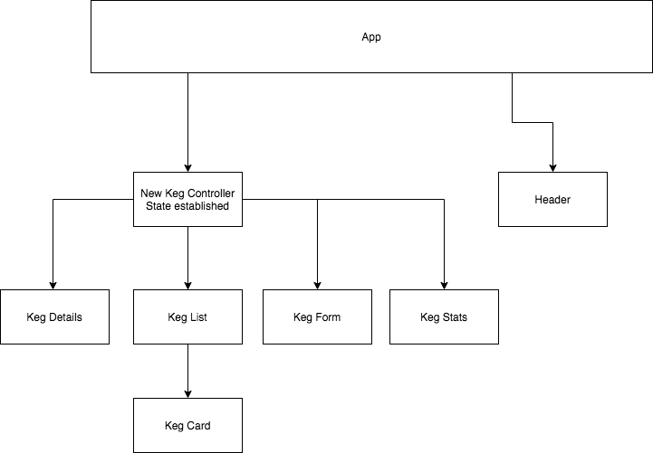

# Orca Watch

#### React Fundamentals Exercise for [Epicodus](https://www.epicodus.com/), 04.24.2020

#### By **Adela Darmansyah, Steven Fleming, Jack Dunning**

[About](#About) | [Screenshots](#Screenshots) | [Bugs](#Known-Bugs) | [Technologies](#Technologies-Used) | [Contact](#Support-and-Contact-Details)

   

## About

This is a web application to track Kegs.

## Screenshots

## React Component Diagram

Sample layout:

Component Diagram:

## Known Bugs

No known bugs at this time.

## Technologies Used

- HTML
- CSS
- JavaScript
- React
- Draw.io

## Support and Contact Details

Feel free to provide feedback via email: 12flemings@gmail.com

### License

This application is licensed under the MIT license.

Copyright (c) 2020 ** Steven Fleming**
